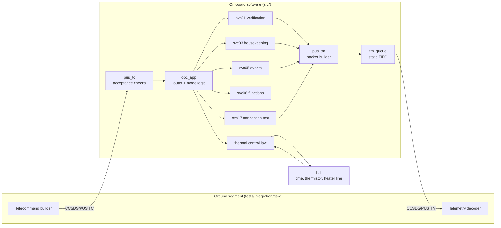

# OBSW-PUS — an ECSS-compliant PUS service handler, and the evidence that it works

A spacecraft on-board software core in C99 that terminates a CCSDS/PUS
telecommand link, produces the telemetry downlink, and runs one autonomous
control function — plus the verification apparatus a space project would
expect around it: a requirements baseline, unit and functional test suites,
statement coverage, static analysis, and a traceability matrix that is
generated from the code and fails the build when it develops a hole.

The software is small on purpose. The point of the repository is not the
protocol stack; it is what surrounds it.

| | |
|---|---|
| Flight code | ~1 700 lines of C99, no dynamic memory, no libc beyond `<stdint.h>` and `<stddef.h>` |
| Requirements | 69, each traced to code and to a test |
| Unit tests | 98 cases in 12 files |
| Functional tests | 43 cases driving the software over a TC/TM socket |
| Statement coverage | 99.5% of `src/`, floor enforced at 95% |
| Build warnings | zero, at `-Wall -Wextra -Wpedantic -Wconversion -Wsign-conversion -Werror` |

---

## Quick start

```bash
make            # build the flight sources and the host runner
make test       # 98 unit tests, no external dependencies
make coverage   # statement coverage of src/, with a floor
make static     # no-dynamic-allocation check, then cppcheck
make trace      # regenerate docs/traceability.md and check it for holes
```

The functional suite needs pytest:

```bash
python3 -m venv .venv && .venv/bin/pip install -r tests/integration/requirements.txt
PYTHON=.venv/bin/python make integration
```

And `make verify` runs everything the CI job runs, in the same order.

To talk to the software by hand:

```bash
./build/obc_sim --port 12345
```

It listens on a TCP socket that carries raw CCSDS packets in both directions;
`tests/integration/gsw/` is a small ground segment that speaks it.

---

## What it does

The on-board software implements six PUS services and one control law.



| Service | Subtypes | What it does |
|---|---|---|
| 1 — request verification | 1, 2, 7, 8 | Acceptance and completion reports, with failure codes |
| 3 — housekeeping | 5, 6, 25, 27 | Two report structures, periodic and one-shot generation |
| 5 — event reporting | 1–4, 5, 6 | Six events across three severities, per-event filtering |
| 8 — function management | 1 | Mode, heater, time, counters, and a temperature test hook |
| 17 — connection test | 1, 2 | Are-you-alive |

The control law is a survival heater with hysteresis: on at or below 5 °C,
off at or above 25 °C, and an over-temperature alarm at 40 °C that reports a
high-severity event and drops the unit into SAFE mode. It exists so that the
test suite has behaviour to verify — thresholds, hysteresis, a latch, and a
mode transition — rather than only packet round-trips.

---

## The part that is actually about the job

### Requirements that cannot silently rot

Every requirement in [docs/SRS.md](docs/SRS.md) looks like this:

```markdown
- **SWREQ-APP-070** (Test) The OBSW shall report a high severity event and
  enter SAFE mode when the acquired temperature reaches 40.0 degrees Celsius,
  shall report that event once per excursion, and shall re-arm it once the
  temperature has fallen below 25.0 degrees Celsius.
```

The code that implements it says so:

```c
/**
 * @implements SWREQ-APP-070
 * ...
 */
static void obc_thermal_control(void)
```

and the tests that verify it say so:

```c
/** @verifies SWREQ-APP-070 */
static void test_over_temperature_forces_safe_mode_and_a_high_severity_event(void)
```

`tools/trace_matrix.py` reads all three and produces
[docs/traceability.md](docs/traceability.md). Run with `--check`, as CI does,
it exits non-zero if a requirement has no implementation, if a requirement
whose verification method is *Test* has no test case, or if a tag names a
requirement that no longer exists. A matrix maintained by hand drifts within
a sprint; this one cannot drift without breaking the build.

### Two levels of test, on purpose

**Unit tests** link the module under test against the real modules below it
and drive it through its C API. They use
[`tests/framework/minunity.h`](tests/framework/minunity.h), a 150-line
assertion core with Unity's macro names and semantics, so that the repository
has no external dependency while the test bodies stay portable to
ThrowTheSwitch/Unity under Ceedling on the target.

**Functional tests** launch the software as a separate process and reach it
only through the telecommand link, using an independently written ground
segment in Python. That independence is the point: the packet encoder in
`tests/integration/gsw/packets.py` was written from
[docs/ICD.md](docs/ICD.md), not from the flight source, so a misreading of the
standard that is symmetric between the on-board encoder and decoder still
gets caught.

Test design is by technique, not by inspiration:

| Technique | Where |
|---|---|
| Equivalence partitioning | one case per telecommand rejection path |
| Boundary value analysis | T−1, T, T+1 at all three thermal set points, from both directions |
| State transition testing | SAFE ↔ NOMINAL, including the autonomous transition |
| Fault injection | corrupted CRC, runt packets, foreign APID, wrong PUS issue, malformed lists |
| Load | 50 telecommands back to back, checked for gap-free sequence counts |
| Defensive path coverage | one case per null-pointer guard |

### Determinism instead of sleeps

On-board time is derived from the minor cycle counter rather than the wall
clock, so a given command sequence produces identical time stamps on every
run. The unit suite contains no `sleep`, and the functional suite waits on
telemetry rather than on the clock. The host runner accepts `--tick-ms` so the
functional suite runs the software ten times faster than flight without the
software knowing.

### Things that were deleted rather than explained

Two findings came out of the coverage report and were fixed by removing code,
not by adding a test: an unused HAL accessor, and a service 1 entry point that
no path could reach because acceptance failures are reported from the raw
octets. A third was a length check that the preceding checks made provably
redundant. The three statements still uncovered are listed in
[docs/SVP.md](docs/SVP.md) section 5 with the reason each cannot be reached —
listed rather than excluded from the metric.

---

## Repository layout

```
include/pus/     public headers, one per module
src/             flight sources - no dynamic memory, no floating point
sim/             host runner: the TC/TM socket, standing in for the SpaceWire driver
tests/framework/ Unity-compatible assertion core and shared test helpers
tests/unit/      98 unit test cases
tests/integration/
    gsw/         independent ground segment: packet codec, link, mission database
    test_*.py    43 functional cases
tools/           traceability matrix generator, coverage reporting
docs/            SRS, ICD, verification plan, coding standard, generated matrix
```

| Document | What it is |
|---|---|
| [SRS.md](docs/SRS.md) | 69 requirements, each with a verification method |
| [ICD.md](docs/ICD.md) | Packet layouts, identifiers, failure codes, deviations |
| [SVP.md](docs/SVP.md) | Verification levels, techniques, coverage floors, acceptance criteria |
| [CODING_STANDARD.md](docs/CODING_STANDARD.md) | The rules the build enforces |
| [traceability.md](docs/traceability.md) | Generated — requirement to code to test |

---

## Design decisions worth arguing about

**The acceptance checks run in a fixed order, and the CRC comes early.**
Nothing in a telecommand is interpreted before the packet error control field
verifies, so a bit flip on the link is reported as a CRC failure rather than
as a mis-addressed packet. `SWREQ-TC-015` states the order, and a test case
sends a packet that is both corrupted and mis-addressed to prove which one
wins.

**The downlink queue drops the newest packet on overflow, not the oldest.**
The packets already queued describe the onset of the anomaly; those are the
ones the ground segment needs. The queue cannot report its own overflow — the
report would be the next thing dropped — so the application samples the
counter once per minor cycle and reports it when there is room again.

**A rejected telecommand changes nothing.** Telecommands carrying a list of
identifiers validate the whole list before applying the first element, so a
partially applied command is not a state the ground has to reason about.

**One owner for the heater line.** The state published in housekeeping, the
hardware line and the event report are written in one function, so they cannot
disagree, whether the change came from ground or from the control law. That
was a real bug in an earlier revision, caught by a functional test that
compared housekeeping against what it had just commanded.

**A documented deviation beats silent non-compliance.** The message type
counter is kept per service type rather than per (APID, type, subtype), which
costs 512 bytes instead of 128 KiB. It is written down as deviation D-01 in
the SRS, the ICD and the source.

---

## Porting to a target

The application core touches the platform only through
[`include/pus/hal.h`](include/pus/hal.h): time, thermistor, heater line.
`src/hal_host.c` is the host implementation; a LEON3/GR712 build replaces that
one file with a BSP implementation over the RTEMS clock driver and the
relevant GPIO, and `sim/obc_sim.c` with the SpaceWire or UART receive path.
Nothing above the HAL changes, and the unit suite runs unmodified on the
target under Ceedling.

Not in scope here, and named so the boundary is deliberate: worst case
execution time and stack analysis, memory partitioning evidence, services 6,
11, 15 and 23, redundancy management, and target hardware campaigns.

## Licence

MIT, see [LICENSE](LICENSE).
